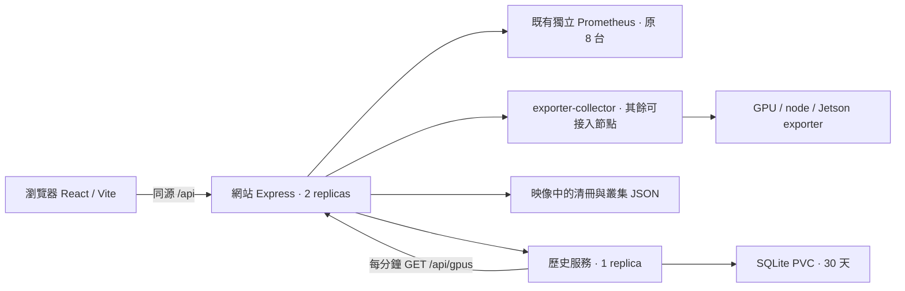

# HPC Lab 網站架構與維護手冊

更新：2026-10-03。此文件以目前程式與線上架構為準；硬體覆蓋現況另見 [exporter-rollout-2026-10-03.md](exporter-rollout-2026-10-03.md)。

## 1. 系統邊界



網站映像 `pokai516/hpc-lab:latest` 同時包含前端、Express 與歷史服務程式。線上 `hpc-lab-site` 為 2 個副本；歷史資料由獨立的 `hpc-lab-history` 單一寫入者保存。瀏覽器不直接連接 Prometheus、exporter、歷史服務或叢集內部位址。

| 層次 | 主要檔案 | 職責與修改入口 |
| --- | --- | --- |
| 路由與首頁 | `src/App.tsx` | 路由表、首頁 Hero、首頁即時摘要與聯絡表單。新增頁面時在路由表與 `src/lib/constants.ts` 的選單同步登記。 |
| 共用導覽 | `src/components/layout/Navigation.tsx`、`MenuOverlay.tsx`、`Footer.tsx` | 頂部導覽、手機選單、明暗主題及頁尾。全站 bar 由同一元件輸出。 |
| 算力監控 | `src/components/GpuFleet.tsx`、`MonitoringChrome.tsx` | 5 秒輪詢、精簡節點卡片、篩選、詳情側欄、歷史圖表。`?machine=<清冊 ID>` 可直接開啟節點。 |
| 叢集資訊 | `src/components/Infrastructure.tsx` | 讀取帶日期的叢集快照；不能把快照當作即時監控。 |
| 靜態內容 | `src/data/*.ts`、`src/components/pages/*.tsx` | 研究、專案、成員、論文、新聞等資料與頁面。新增內容優先編輯資料模組。`/research` 轉至首頁研究區。 |
| 視覺系統 | `src/index.css`、`src/styles/home-live.css`、`src/styles/fleet.css`、`src/components/ResearchNetwork3D.tsx` | 全站共用色彩留在 `index.css`，首頁即時區和節點監控各有獨立樣式模組。首次造訪預設暗色，手動選擇存於 `hpclab-theme`，淺色使用柔和紙色；內容頁與頁尾共用主題變數。動畫須支援 `prefers-reduced-motion`。 |
| HTTP API | `server.ts` | 公開 API、資料淨化、原 Prometheus 查詢、聯絡表單與歷史服務代理。新 API 先定義輸入驗證與輸出白名單。 |
| Exporter 採集 | `exporter-collector.ts`、`gpu-telemetry.ts`、`exporter-targets.default.json` | 私有目標每 5 秒採集，依機器 ID 合併 CPU/GPU 遙測；地址只留伺服器。 |
| 歷史資料 | `tools/history-service.ts`、`tools/monitoring-history.yaml` | 每分鐘從公開安全的 `/api/gpus` 取樣，單寫入 SQLite，保留 30 天；透過網站 API 查詢。 |
| 清冊與快照 | `tools/build-inventory.py`、`probe-inventory.py`、`finalize-inventory.py`、`build-cluster-status.py` | 原始清冊、連線探測、容量去重、叢集快照。完整重跑方式見 [tools/README.md](../tools/README.md)。 |
| Exporter 管理 | `tools/exporters/` | 安裝、目標產生、受限轉送、GPU 叢集 DaemonSet。安裝與覆蓋範圍見 [README.md](../tools/exporters/README.md)。 |

`App.tsx` 仍包含首頁 Hero、研究區與聯絡區；維護時應依上述邊界新增模組，不再把監控或新內容頁塞回這個檔案。`GpuFleet.tsx` 目前是一個頁面模組；若繼續增加詳情功能，可按 `overview`、`detail`、`history` 拆成子元件，保持同一份節點資料型別與採樣判斷。

## 2. 公開路由與 API

| 路徑 | 用途 | 資料性質 |
| --- | --- | --- |
| `/` | 實驗室首頁、真實算力摘要、研究入口 | 監控摘要每 15 秒更新；其餘為內容資料。 |
| `/gpus` | 節點清單、目前狀態、單機歷史 | 前端每 5 秒取得 API；逾 120 秒採樣不當作即時。 |
| `/infrastructure` | 叢集與虛擬化資源 | 有 `updatedAt` 的盤點快照。 |
| `/projects`、`/people`、`/publications`、`/news`、`/contact` | 內容頁 | `src/data/` 或聯絡 API。 |
| `/research` | 舊網址相容 | 轉至 `/#research`，不保留重複頁面。 |

| API | 用途 |
| --- | --- |
| `GET /api/gpus` | 合併 Prometheus、獨立 exporter、裝置清冊與 TCP 存活探測；提供最新 GPU/CPU/RAM 及總量。 |
| `GET /api/lab-inventory` | 僅公開可顯示的清冊機器。 |
| `GET /api/cluster-status` | 讀取 `updatedAt` 較新的叢集快照。 |
| `GET /api/monitoring/history/:machineId?hours=24` | 經網站代理歷史服務；只接受白名單時間範圍與安全 ID。 |
| `POST /api/contact` | 寫入聯絡表單 SQLite。`/api/messages` 是需管理者授權的後台 API。 |
| `POST /api/internal/exporter-telemetry` | 筆電等無法拉取的設備用 HTTPS push；需 Secret 中的 token。 |

## 3. 資料定義與安全約束

- **容量的來源是清冊**：實體主機只計一次；GPU 直通客體不重複計；`display-only` 和 Jetson `edge` 不併入一般 GPU 總量。探測不到、已移走的機器不顯示、不計算容量。
- **狀態有三層**：exporter／Prometheus 有效採樣可顯示使用率；TCP 可達只顯示「連線正常」；離線保留最後回應時間。`null` 是未知，不等於 0%。超過 120 秒的 GPU/CPU 採樣不能畫成即時值。
- **MIG**：整卡 `util` 不可用時顯示原因與切片配置；切片容量不當成使用率。一張實體 A100 仍只計一張 GPU。
- **歷史**：歷史服務從啟用後才開始記錄，按分鐘保存平均 GPU 使用率、CPU、RAM、在線狀態。空白區間維持空白，不回填或插值。查詢範圍 1/6/24/168/720 小時，保留 30 天。
- **敏感資料**：清冊試算表 N/O 欄是帳密，解析器只讀至第 13 欄；不得輸出到 repo、日誌或瀏覽器。`ip`、`ports`、exporter URL、instance、push token、管理密碼都不得進入公開 API。`ADMIN_PASSWORD` 未設時後台拒絕登入。

## 4. 本機開發與驗證

```powershell
npm ci
npm run dev
npm run lint
npm run build
node --import tsx tools/verify-exporter-collector.mjs
node tools/verify-exporter-api.mjs
node tools/verify-gpu-monitoring.mjs
```

本機未設定 `PROMETHEUS_URL` 或 exporter 目標時，`/api/gpus` 可以回 503；前端版型檢查可用測試假資料攔截 API。歷史服務可單獨以 `npx tsx tools/history-service.ts` 啟動，指定 `HISTORY_SOURCE_URL`、`HISTORY_DB_PATH`、`PORT`；正式環境由 `tools/monitoring-history.yaml` 設定。任何測試都不要回傳或記錄設備帳密／內網地址。

## 5. 部署與回復

1. 盤點有變動時，先照 [tools/README.md](../tools/README.md) 重產 `lab-inventory.default.json` 與 `cluster-status.default.json`；不要使用舊的 `collect-cluster-status.sh`，其 schema 不相容。
2. `npm run lint`、`npm run build` 與相關驗證通過後，`docker build -t pokai516/hpc-lab:latest .`、`docker push pokai516/hpc-lab:latest`。
3. 用 `kubectl --kubeconfig <kubeconfig> apply -f tools/monitoring-history.yaml` 部署歷史服務，並在網站 Deployment 設定 `HISTORY_SERVICE_URL=http://hpc-lab-history:3001`。再 rollout restart `hpc-lab-site`。
4. 核對兩個網站 Pod 與歷史 Pod 的 **imageID digest** 都等於剛推送的 digest；確認 Ready、`/api/gpus`、`/api/monitoring/history/<有效 ID>` 和首頁。網站 Pod selector 是 `app=hpc-lab`，歷史服務是 `app=hpc-lab-history`。
5. 出問題時回復到前一個已驗證 digest 並重啟 Deployment。歷史 PVC 不要刪除；同一份記錄仍可供回復後的網站讀取。

`k8s-deploy.yaml` 是較早的參考清單，仍寫 1 replica、未含目前的執行環境變數；**不要直接套用覆蓋線上 Deployment**。線上網站目前是 2 replicas、`pullPolicy=Always`、`pk-master1` 節點，原有網站聯絡表單 SQLite 使用既有掛載。監控歷史改用單一寫入者與 PVC，沒有寫入網站原有 hostPath，也不修改 Rancher Monitoring／Prometheus 抓取設定。`local-path` PVC 綁定單一節點，若該節點故障，歷史服務須等儲存卷恢復才能繼續；網站即時監控仍可獨立運作。
